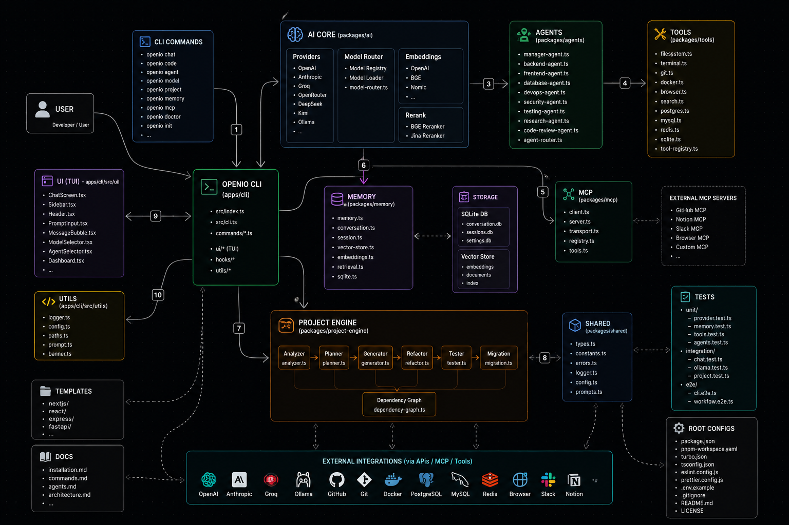

# OpenIO

### The Open Source AI Coding Assistant

[English](#english) |
[简体中文](#简体中文) |
[繁體中文](#繁體中文)

 

🚧 **Project Status: Under Active Development**

OpenIO is currently in active development and has not been released yet.

---

# English

## About

OpenIO is an open-source AI coding assistant built for developers.

Features:

* Multi-Provider AI Support
* Multi-Agent Architecture
* MCP Integration
* Local & Cloud Models
* Memory System
* Project Engine
* Terminal UI

---

# 简体中文

## 关于

OpenIO 是一个面向开发者的开源 AI 编程助手。

功能：

* 多模型支持
* 多智能体系统
* MCP 集成
* 本地与云端模型
* 记忆系统
* 项目引擎
* 终端界面

---

# 繁體中文

## 關於

OpenIO 是一個面向開發者的開源 AI 程式設計助手。

功能：

* 多模型支援
* 多代理系統
* MCP 整合
* 本地與雲端模型
* 記憶系統
* 專案引擎
* 終端介面

---

## SYSTEM-系统架构

  
  

  

## License

MIT License
